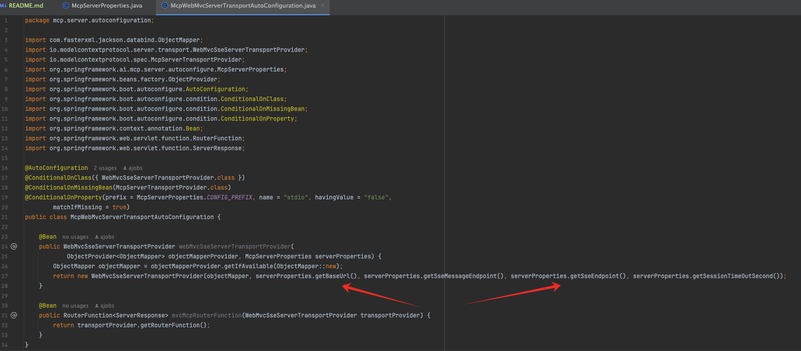
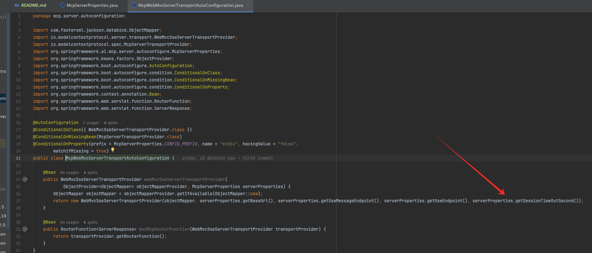
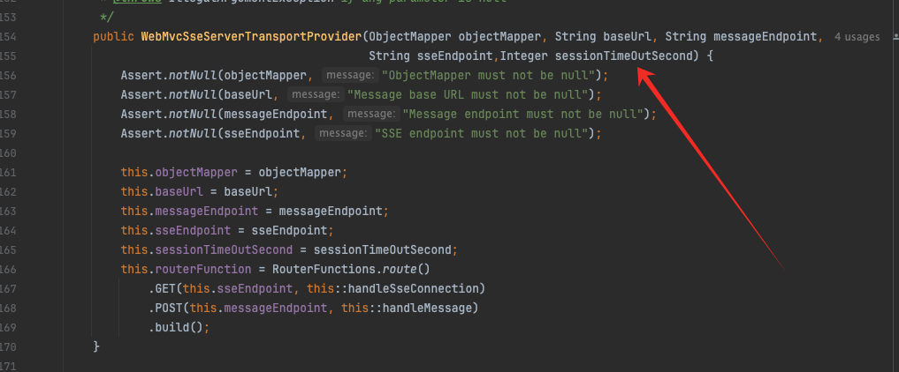
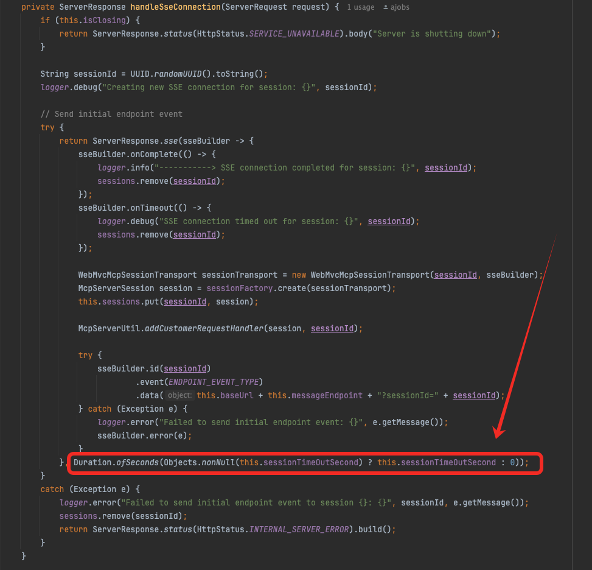
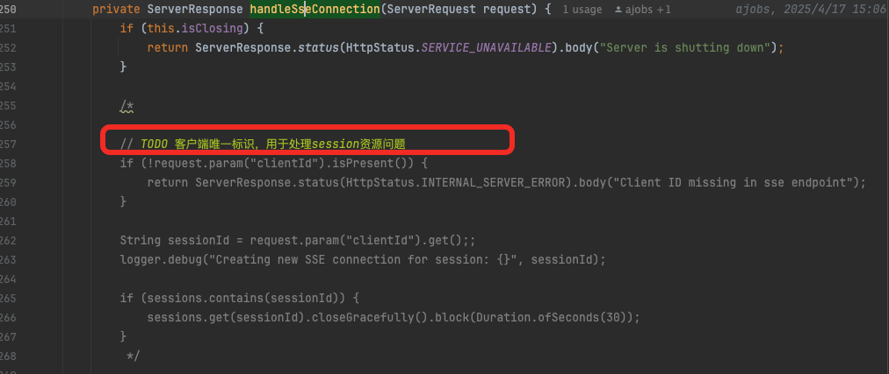

# 项目依赖
spring ai 1.0.0-M7

# 版本异常问题
 ## 配置问题  
org.springframework.ai.mcp.server.autoconfigure.McpServerProperties 中出现的一下配置属性不生效
- baseUrl
- sseMessageEndpoint

解决办法：  
重写类  
- mcp.server.autoconfiguration.McpWebMvcServerTransportAutoConfiguration
- io.modelcontextprotocol.server.transport.WebMvcSseServerTransportProvider  
  


# 自定义功能
## session没有timeout功能  
解决办法：  
- org.springframework.ai.mcp.server.autoconfigure.McpServerProperties 新增 sessionTimeOutSecond 属性，单位：秒

- 重写： io.modelcontextprotocol.server.transport.WebMvcSseServerTransportProvider   
1.充血 构造函数  
  
2.io.modelcontextprotocol.server.transport.WebMvcSseServerTransportProvider.handleMessage  


## 新增手动清除session的message
message种类： mcp.server.constant.MessageEnum  
message注入形式： io.modelcontextprotocol.server.transport.McpServerUtil  

client需要新增代码,这里用java的客户端 McpAsyncClient 为例，新增方法：
```java
	/**
	 * 会话优雅关闭
	 * @return
	 */
	public Mono<McpSchema.JSONRPCResponse> sessionCloseGracefully() {
		return this.mcpSession.sendRequest(MessageEnum.sessionCloseGracefully.name(), null,
				new TypeReference<>() {
				});
	}
```


# 待解决问题
sse中mcp server需要维护一个session进行消息推送。问题来了，后端session释放时机？？？？  
mcp客户端主动释放：  
mcp客户端新增一个自定义 mcp message（“sessionCloseGracefully”）（  
https://github.com/modelcontextprotocol/java-sdk  
官方的mcp message:  io.modelcontextprotocol.spec.McpSchema  
），示例代码：  
```java
// io.modelcontextprotocol.client.McpSyncClient#sessionCloseGracefully
/**
	 * 会话优雅关闭
	 * @return
	 */
public Mono<McpSchema.JSONRPCResponse> sessionCloseGracefully() {
    return this.mcpSession.sendRequest("sessionCloseGracefully", null,
                                       new TypeReference<>() {
                                       });
}
```  
  
  
  
--------------  
问题：mcp客户端重启， 导致mcp server内存泄露  
解决方案： 每个mcp客户端的 sse endpoint 可以加上唯一标识：比如"/sse?clientId=osrunner (osrunner-1、lab、lab-1.......)"。 当mcp客户端重启并建立sse时，因为存在唯一标识，所以 mcp server可覆盖之前旧的session。  
后端兼容代码位置：io.modelcontextprotocol.server.transport.WebMvcSseServerTransportProvider.handleSseConnection  


你以为完美解决了吗？  
不，当mcp server多服务，则存在负载均衡问题。导致mcp server内存泄露  
解决方案： 摆了，资源浪费很有限  
当然还有一种解决方案： 定时去让服务端去ping客户端，出现异常后，服务端会清除无效的session（Bean注入默认关闭），代码维护：  
mcp.server.autoconfiguration.McpCustomConfiguration.mcpScheduleTask  
mcp.server.McpScheduleTask.checkPing


我们假设mcp client是单一且长期存在的。  
问题: mcp server重启，mcp客户端sse连接出现异常  
1、创建完成sse连接后，mcp server重启期间，mcp客户端请求mcp message响应：    
io.modelcontextprotocol.client.transport.HttpClientSseClientTransport -- Error sending message: 404  
2、mcp server未启动，客户端请求建立sse, 请求响应：  
io.modelcontextprotocol.client.transport.HttpClientSseClientTransport -- SSE connection error  
解决方案：  mcp客户端 触发轮询重新构造，覆盖老的mcp客户端对象。  


综上所诉：  
- 客户端遇见异常时，要有轮询重新初始化操作兜底  
- 客户端建立sse连接需要有唯一标识 /sse?clientId=xxxxx. (多机mcp server会出现内存泄露，但是可控)  
- 客户端关闭sse连接前，向mcp server发送优雅关闭的mcp message （上文提到的sessionCloseGracefully）（本地客户端测试）  


